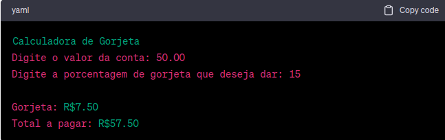

<h1 align="center">Calculadora de Gorjeta</h1>

## Descrição 

Uma simples calculadora de gorjeta em Ruby que permite aos usuários calcular a gorjeta com base no valor da conta e na porcentagem de gorjeta desejada. Este programa utiliza a biblioteca 'colorize' para adicionar cores ao texto no terminal.

* ### Pré-Requisitos
 
  - Ruby instalado na sua máquina.
  - A biblioteca 'colorize' instalada. Você pode instalá-la usando o comando gem install       
    colorize.

* ### Como Usar
  
  - Clone ou baixe este repositório para sua máquina.
  - Navegue até a pasta onde o código está localizado.
  - Execute o programa com o comando ruby calculadora_de_gorjeta.rb.
  - Siga as instruções no terminal para inserir o valor da conta e a porcentagem de gorjeta 
    desejada.
  - O programa calculará a gorjeta e o valor total a ser pago e exibirá as respostas em 
    amarelo.

* ### Exemplo
Aqui está um exemplo de como usar o programa:
<h1 align="center">
  
</h1>

* ### Contribuindo
  
Se desejar contribuir com melhorias neste projeto, fique à vontade para criar um fork, fazer suas alterações e enviar um pull request. Suas contribuições são bem-vindas!

* ### Licença

Este projeto está licenciado sob a Licença MIT

