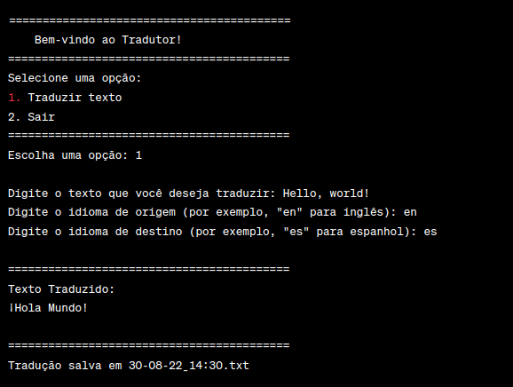

<h1 align="center">Programa Tradutor Ruby</h1>

## Descrição 

Este é um programa simples de linha de comando escrito em Ruby que utiliza a API Yandex Translate para traduzir texto de um idioma para outro. O programa oferece uma interface de menu amigável para selecionar a ação desejada, como traduzir texto ou sair do programa.

* ### Requisitos

  - Ruby instalado no sistema (versão 2.0 ou superior).
  - Acesso à internet para usar a API Yandex Translate.
  - A gema 'colorize' instalada para melhor formatação da saída no terminal.

* ### Configuração

  - Clone ou faça o download deste repositório em seu sistema.
  - Certifique-se de que o Ruby está instalado.
  - Instale a gema 'colorize' usando o comando gem install colorize.

* ### Uso

   - Abra o terminal e navegue até o diretório onde o programa está localizado.
   - Execute o programa com o comando ruby App_Tradutor.rb.
   - O programa exibirá um menu com as seguintes opções:
   - Traduzir texto: Você pode inserir um texto, o idioma de origem e o idioma de destino e obter a tradução.
   - Sair: Para encerrar o programa.

* ### Exemplo
Aqui está um exemplo de como usar o programa:

<h1 align="center">
  
</h1>

* ### Contribuição

Sinta-se à vontade para contribuir com melhorias, correções de bugs ou recursos adicionais. Basta criar um fork deste repositório, fazer as alterações desejadas e enviar um pull request.

* ### Licença

Este programa é distribuído sob a Licença MIT.

<h4 align="left"> 
	  Programa Tradutor Ruby 🚀 Concluído  
</h4>

