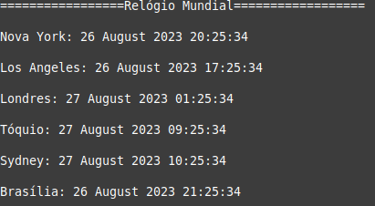

<h1 align="center">Relógio Mundial em Ruby</h1>

## Descrição 

 Este é um simples programa em Ruby que exibe a hora atual em várias cidades ao redor do mundo, utilizando a biblioteca tzinfo para lidar com fusos horários.

 * ### Pré-requisitos

    - Ruby instalado na sua máquina.
    - A biblioteca tzinfo instalada. Você pode instalá-la usando o comando gem install tzinfo.

* ### Como Usar

    - Clone ou baixe este repositório para sua máquina.
    - Navegue até a pasta onde o código está localizado.
    - Execute o programa com o comando ruby relogio_mundial.rb.

* ### Exemplo

Aqui está um exemplo de como usar o programa:

   * ### Cidades Disponíveis
     - Nova York (America/New_York)
     - Los Angeles (America/Los_Angeles)
     - Londres (Europe/London)
     - Tóquio (Asia/Tokyo)
     - Sydney (Australia/Sydney)
     - Brasília (America/Sao_Paulo)
<h1 align="center">
  
</h1>

* ### Contribuição

Se desejar contribuir com melhorias neste projeto, fique à vontade para criar um fork, fazer suas alterações e enviar um pull request. Suas contribuições são bem-vindas!

* ### Licença

Este programa é distribuído sob a Licença MIT.

<h4 align="left"> 
	  Programa Tradutor Ruby 🚀 Concluído  
</h4>

